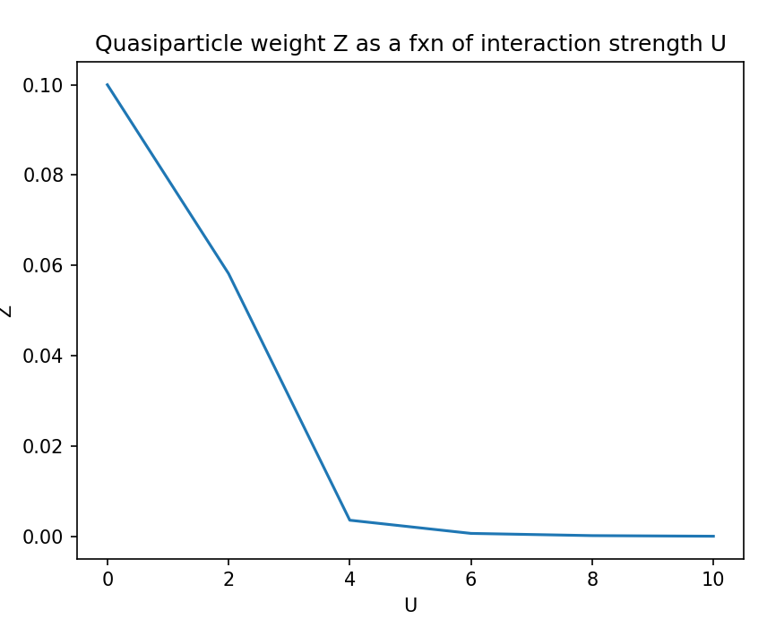

# UROP

Nov 21 - Talk about gituhub, papers, and personal development plan

Nov 24 - Working on recreating section 2.2 in Minimum Hardware Requirements for Hybrid Quantum-Classical DMFT.
         What my current (obviosly incorrect) plot looks like:
         

Dec 2 - Worked some more on DMFT fixing Hamiltonian and impurity greens function. Currently having issues with    how to incorporate t* (or understanding why t* is necessary)
       Current plot (still wrong but a little better I think):
       
        
Dec 7 - I fixed some of the logic and the graph looks really good I think. Definitely the closest it has been
        current plot : 

        Edit: I cleaned up the code to make th graph look a little better. I think I am going to move on now to doing it with qiskt
        current plot: 

Jan 16/18 - Working on DMFT routine again but this time using qiskit circuit to find impurity greens function
       no plot yet

Feb 27 - Current plot: 
         Edit: new current plot even though I didn't change any of the code: 